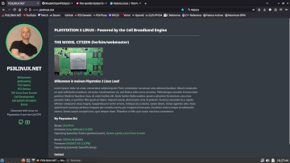

# ps3linux-hugo-website

---

This git repo contains the resources used to generate my website ([PS3LINUX.NET](http://www.ps3linux.net)) using [HUGO](https://gohugo.io) (an open source "static website generator" written in GO).

Obviously this website is still very much a work in progress, but I have gone ahead and published it on my web server (a home built desktop/gaming rig running [Fedora Server](https://fedoraproject.org) and httpd/Apache).

Full Disclosure: Yes, this website was previously hosted on my Playstation 3 (running Fedora 12 ppc and httpd) for almost the past 2 years. However the PS3 is a highly experimental platform on which I regularly break the operating system and must re-install/re-configure the whole thing (sometimes several times in a month), resulting in a huge amount of downtime (by web server standards). Thus I decided to make my desktop computer the new main server, as it is always on, operational, and stable. My PS3 web server had a good run, and I feel I've demonstrated my point - that the PS3 (with Linux) is way more than just the premier video gaming system ever built; it's also my favorite mini supercomputer. Good news is my PS3 is still going strong (knock on wood) and my research/study of CELL computing continues...

**TODO: Get a CA certificate so I can use https like a real website...**

